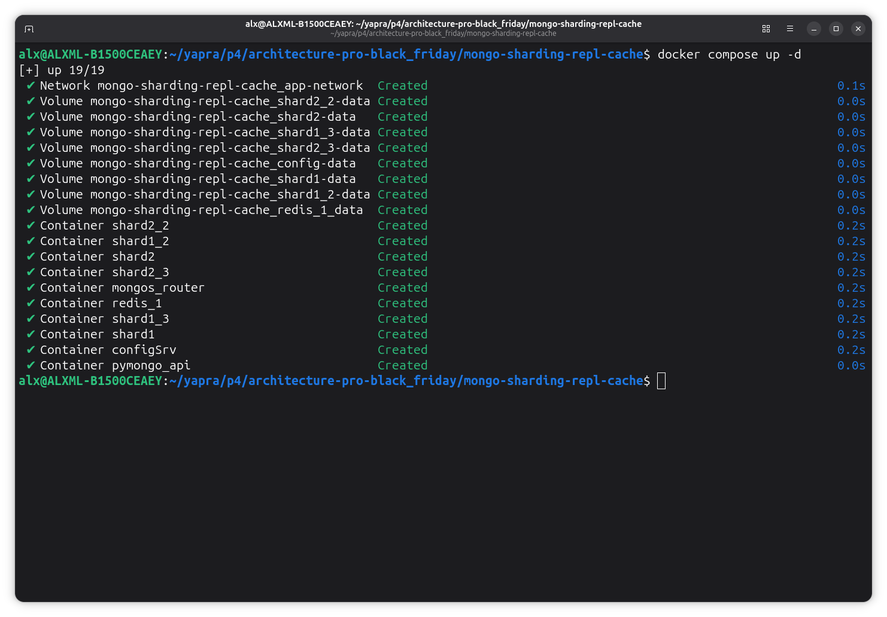
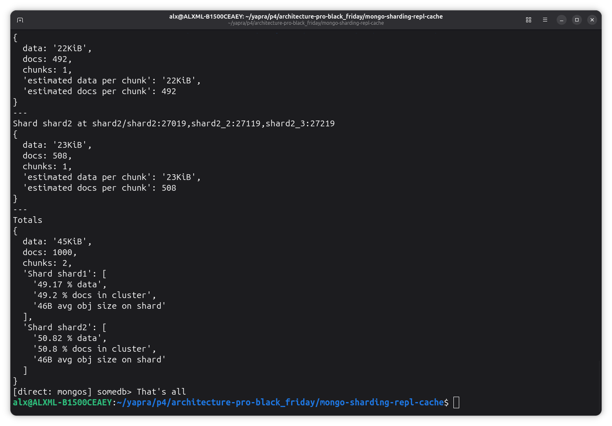
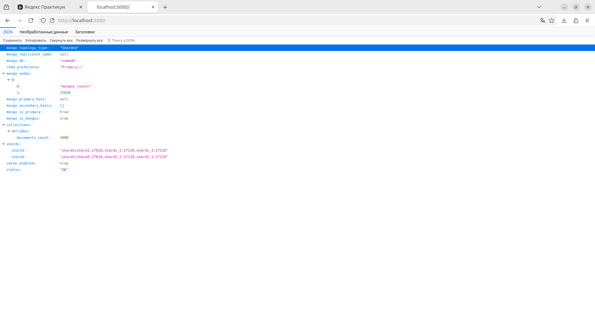
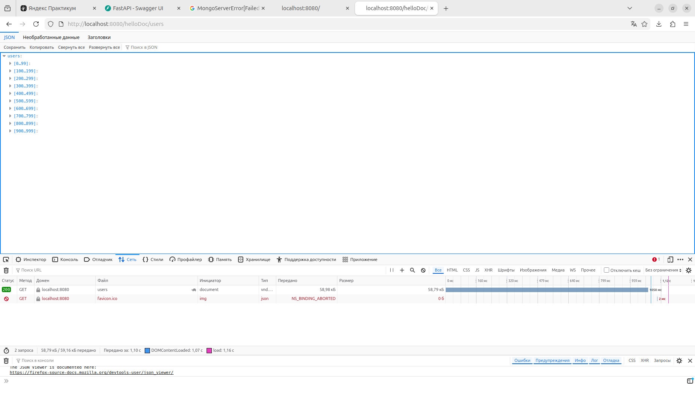
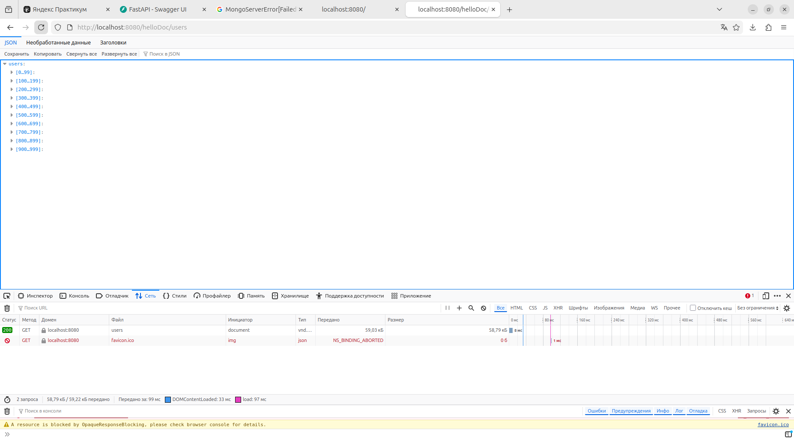

# pymongo-api-sharding-repl-cache

## Как запустить

Запускаем СУБД mongodb Redis, сервер кеширования и приложение

```shell
docker compose up -d --build
```



Перед запуском желательно убедиться в отсутствии volumes (виртуальных дисков docker) с именами, используемыми приложениями. Очистить диски можно командой

```shell
docker stop $(docker ps -q) # останавливаем все приложения
docker volume prune # удаление образов 
docker network prune #удаление сетей
```

Заполняем mongodb данными

```shell
./scripts/mongo-init.sh
```

При успешном заполнении будет выведена информация о распределении по шардам и репликам в их составе:

```
[direct: mongos] somedb> Shard distribution:

[direct: mongos] somedb> Shard shard2 at shard2/shard2:27019,shard2_2:27119,shard2_3:27219
{
  data: '23KiB',
  docs: 508,
  chunks: 1,
  'estimated data per chunk': '23KiB',
  'estimated docs per chunk': 508
}
---
Shard shard1 at shard1/shard1:27018,shard1_2:27118,shard1_3:27218
{
  data: '22KiB',
  docs: 492,
  chunks: 1,
  'estimated data per chunk': '22KiB',
  'estimated docs per chunk': 492
}
---
Totals
{
  data: '45KiB',
  docs: 1000,
  chunks: 2,
  'Shard shard2': [
    '50.82 % data',
    '50.8 % docs in cluster',
    '46B avg obj size on shard'
  ],
  'Shard shard1': [
    '49.17 % data',
    '49.2 % docs in cluster',
    '46B avg obj size on shard'
  ]
}
[direct: mongos] somedb> That's all

```



## Как проверить

### Если вы запускаете проект на локальной машине

Откройте в браузере http://localhost:8080



Обратите внимание на строку cache_enabled	true, что говорит нам об использовании кеша Redis веб-сервисом.

### Если вы запускаете проект на предоставленной виртуальной машине

Узнать белый ip виртуальной машины

```shell
curl --silent http://ifconfig.me
```

Откройте в браузере http://<ip виртуальной машины>:8080

## Доступные эндпоинты

Список доступных эндпоинтов, swagger http://<ip виртуальной машины>:8080/docs

## Проверка работы кешеровния

Для проверки работы выполним GET запрос `http://localhost:8080/helloDoc/users` любым HTTP клиентом (например, браузером firefox) 

Время ответа составило более секунды:
 - данные на этом шаге были прочитаны из базы, но результат запроса был закеширован.

Попробуем выполнить запрос второй раз - результат запроса будет тем же, но выполнился существенно быстрее - за 8 мс
